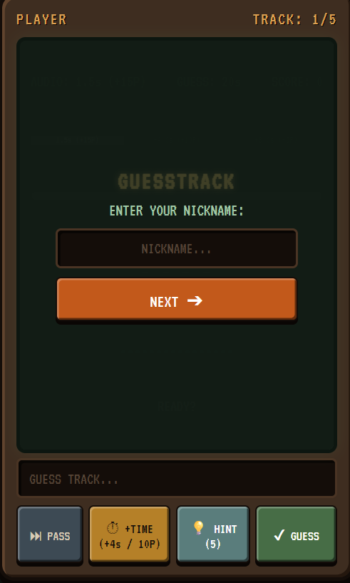
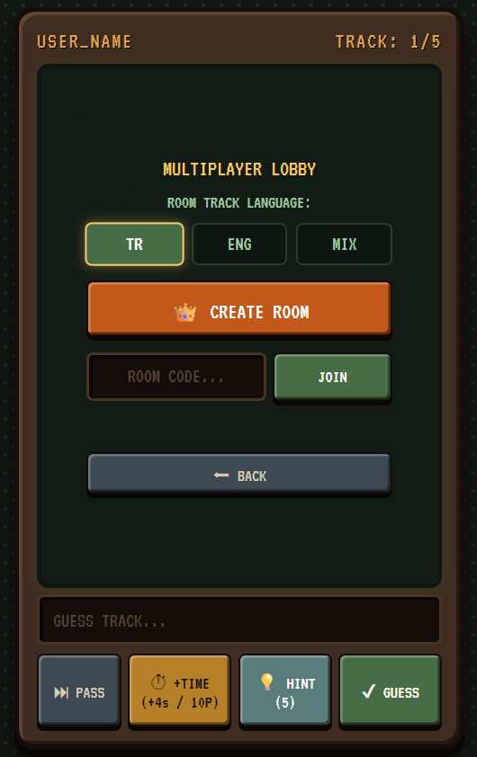
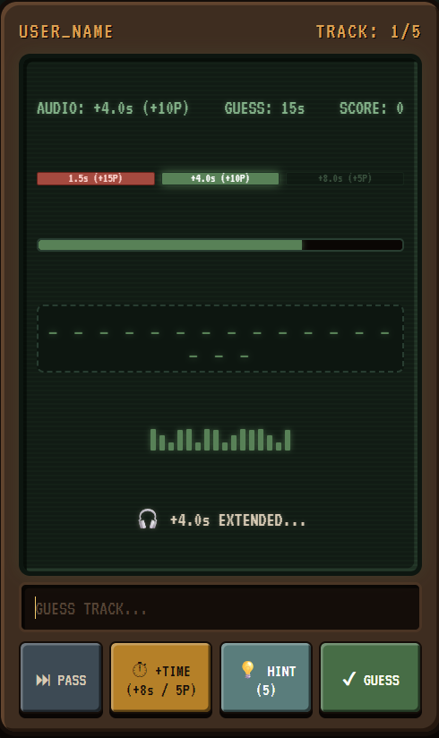

# 🎵 GuessTrack

<p align="center">
  
  
  
</p>

GuessTrack is a real-time, retro-arcade style music guessing game. Test your music knowledge by listening to short audio previews and identifying the correct tracks before time runs out. Play solo to climb the global leaderboard or challenge a friend in the real-time 1v1 multiplayer arena!

## ✨ Features

* **Solo & 1v1 Multiplayer Modes:** Features a local solo progression system and a live multiplayer mode utilizing WebSockets for real-time room creation and competitive duels.
* **Retro Arcade UI:** Designed with a custom pixel-art aesthetic, featuring CRT screen effects, animated visualizers, and interactive haptic feedback.
* **Music API Integration:** Dynamically fetches audio previews across different languages (English/Turkish) using exact-match filtering for accuracy.
* **Live Leaderboard:** Integrated SQLite database to track, save, and display the top-scoring players seamlessly.

## 🛠️ Tech Stack & Structure

* **Backend:** Python, Flask, Flask-SocketIO (Eventlet)
* **Database:** SQLite (`scores.db`)
* **Frontend:** HTML5, CSS3, Vanilla JavaScript
* **Deployment Setup:** Ready for Render deployment with `Procfile` and `requirements.txt` included.

## 🚀 Local Setup

To run this project locally on your machine, follow these steps:

1. **Clone the repository:**
   ```bash
   git clone https://github.com/jdaklyn/GuessTrack.git
   cd GuessTrack